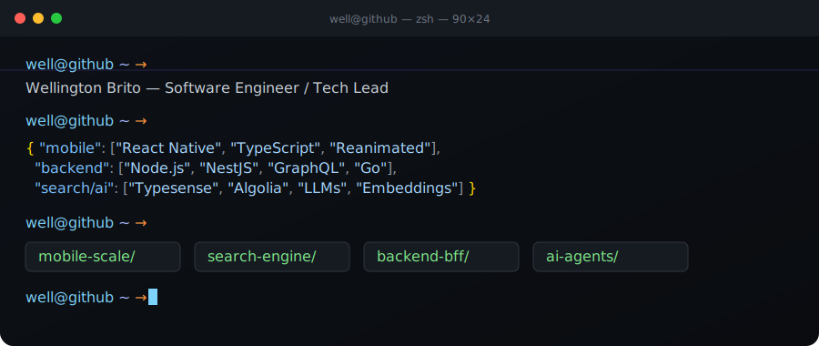

<!--
  Wellington Brito — GitHub Profile README
  Repo: Wellbrito29/Wellbrito29
-->

<div align="center">
  
</div>

<br />

<div align="center">
  <a href="https://www.linkedin.com/in/wellington-nascimento-de-brito-657720143"></a>
  <a href="https://medium.com/@well33488"></a>
  <a href="mailto:wellnascimento.brito@gmail.com"></a>
  <a href="https://github.com/Wellbrito29"></a>
</div>

<br />

# 👋 Hi, I'm Wellington Brito

**Software Engineer · Tech Lead** — São Paulo, BR 🇧🇷

```ts
const wellington = {
  role: "Software Engineer / Tech Lead",
  focus: ["React Native", "Search Engineering", "Backend", "AI/ML"],
  stack: ["TypeScript", "Node.js", "NestJS", "Next.js", "Go", "Python"],
  exploring: ["Local LLMs", "AI Agents", "Vector Search", "Spec-Driven Dev"],
  basedIn: "São Paulo · BR 🇧🇷",
  languages: ["pt-BR (native)", "en (professional)"],
  openTo: ["tech leadership", "search engineering", "AI/ML projects"],
};
```

I work on building and evolving **mobile, web, and large-scale backend** applications, combining engineering, product vision, technical quality, and observability.

I enjoy leading teams that ship fast without losing the fundamentals: clean architecture, performance, and great developer experience. Lately I've been deep into **search relevance**, **on-device & local LLMs**, and **agentic AI** — finding the sweet spot between research and production-ready systems.

---

## 🚀 What I'm up to

- 🔭 **Currently building:** scalable React Native experiences and search platforms with relevance tuning end-to-end
- 🌱 **Currently learning:** Learning to Rank, vector retrieval at scale, and orchestration of AI agents
- 💬 **Ask me about:** React Native at scale, search engineering, observability, BFFs, design systems
- ⚡ **Fun fact:** I love bridging product thinking with low-level performance work — from BM25 tuning to FlatList rendering

---

## 🧠 Areas of Expertise

<table>
<tr>
<td valign="top" width="33%">

### 📱 Mobile
- React Native at scale
- New Architecture
- Performance & memory
- FlatList & rendering
- Native SDKs (iOS/Android)
- Version migrations
- Expo · Monorepos
- Mobile observability

</td>
<td valign="top" width="33%">

### 🌐 Web & Backend
- React · Next.js · SSR
- Node.js · NestJS
- GraphQL · REST · BFF
- Apollo Server/Client
- Go (APIs, systems)
- Structured logging
- Scalability
- Design Systems

</td>
<td valign="top" width="33%">

### 🔎 Search & AI
- Typesense · Algolia
- BM25 · Re-ranking
- Vector search · Embeddings
- Image search
- Learning to Rank
- Local LLMs · LoRA · GGUF
- AI Agents
- Spec-Driven Development

</td>
</tr>
</table>

---

## ⚡ Stack

<p>
  
  
  
  
  
  
  
  
  
  
  
  
  
  
  
</p>

---

## 🔎 Search Philosophy

> A good search experience needs to balance:
> ```
> user intent
>   + textual relevance
>   + behavior
>   + product context
>   + performance
> ```

---

## 🧭 How I work

- **Pragmatic over dogmatic** — ship the right abstraction at the right time, not before
- **Observability first** — if you can't measure it, you can't improve it
- **Mentorship matters** — leveling up the team is part of the job, not a side quest
- **Spec-driven** — clear specs unlock autonomy for both humans and AI agents

---

## 🚀 Featured Project

<a href="https://github.com/Wellbrito29/braito">
  
</a>

---

## 📊 GitHub Stats

<div align="center">
  
  
</div>

<div align="center">
  
</div>

<div align="center">
  
</div>

---

## 🐍 Contribution Snake

<div align="center">
  
</div>

---

## 📫 Get in touch

If you'd like to talk about **search**, **mobile at scale**, **AI agents**, or just say hi — I'm happy to chat.

- 💼 [LinkedIn](https://www.linkedin.com/in/wellington-nascimento-de-brito-657720143)
- ✍️ [Medium](https://medium.com/@well33488)
- ✉️ [wellnascimento.brito@gmail.com](mailto:wellnascimento.brito@gmail.com)

---

<div align="center">
  <sub><code>well@github ~ → echo "thanks for stopping by"</code></sub>
</div>
